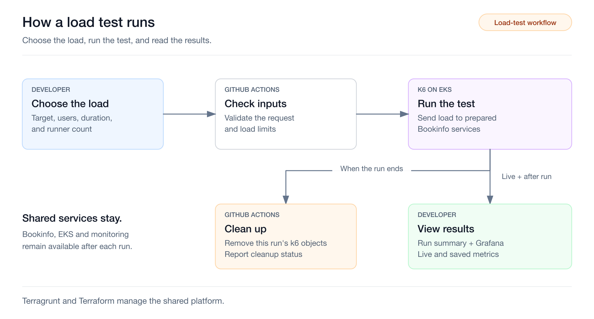
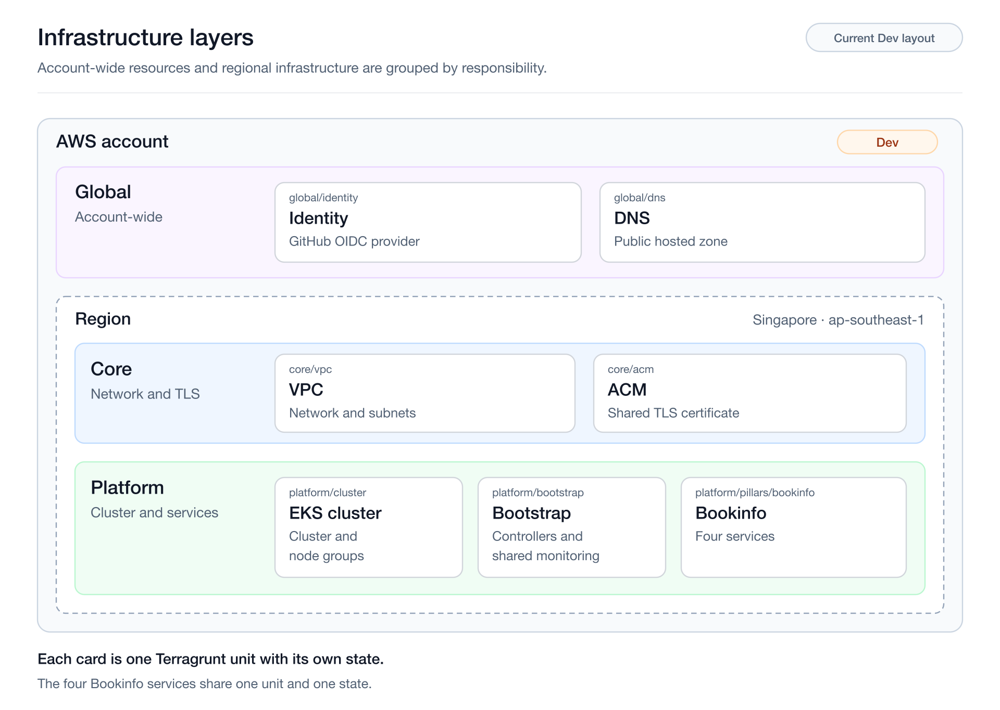
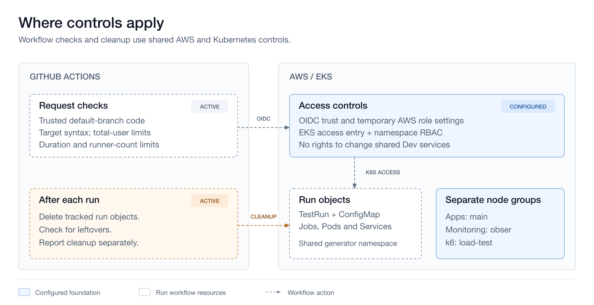

# Self-service load testing on AWS

Run k6 tests through GitHub Actions without a DevOps ticket for each run. The workflow returns results and removes temporary resources.

The final demo is complete and accepted. This repository contains the published implementation, setup instructions, validation evidence and four recorded scenarios. [Validation](docs/validation.md#acceptance-coverage) defines the demonstrated scope and its limits.

## Watch the demo

Start with video 01. All four MP4s are in [`docs/videos/`](docs/videos/), totalling 22 minutes.

| Video | Length | What it shows |
|---|---|---|
| [01. Successful load test](docs/videos/01-successful-load-test.mp4) | 5:02 | Dispatch, live results, successful execution and cleanup. |
| [02. Input validation](docs/videos/02-input-validation.mp4) | 3:46 | Five invalid numeric inputs rejected before the load job. |
| [03. HTTP failure and cleanup](docs/videos/03-http-failure-cleanup.mp4) | 5:35 | A missing route returns 404; execution fails and cleanup succeeds. |
| [04. Cancel one run, preserve its peer](docs/videos/04-cancel-run-preserve-peer.mp4) | 7:37 | Cancel A while B keeps running, then verify both cleanups. |

[Viewing notes](docs/demo-video.md) link the source and runs. [Validation](docs/validation.md) records the accepted evidence and its limits.

## Developer flow



Keep k6 scripts in Git. In GitHub Actions:

1. Choose a scenario; the initial script is `bookinfo.js`.
2. Enter a complete HTTP or HTTPS URL, including its path and query. Kubernetes Service URLs work too.
3. Set total VUs, duration and runners. VUs are shared across runners.

The Summary separates execution and cleanup. When a measurement interval is available, it links to Grafana for latency, throughput and HTTP errors. Developers assess whole-run performance; workflow success alone is insufficient.

[Bookinfo](https://istio.io/latest/docs/examples/bookinfo/) provides four services with real dependencies. The workload targets its product page.

Prepare the application before testing. Cleanup removes only the run's k6 resources; Bookinfo, EKS and monitoring remain.

## Repository structure

Main files and folders are shown below. [Infrastructure layers](#infrastructure-layers) expands the `infra/` layout.

```text
.
├── .github/workflows/                  # GitHub Actions workflows
│   ├── load-test.yml                   # Main load-test dispatch workflow
│   └── verify-load-test-access.yml     # Verify access without sending load
├── config/                            # Workflow configuration
│   └── load-test-policy.json           # Load defaults and allowed ranges
├── load-tests/                        # k6 workloads and runner template
│   ├── bookinfo.js                     # k6 script to test bookinfo
│   └── test-run.yaml                   # k6 TestRun template and Pod controls
├── scripts/                           # Python helpers used by the workflows
│   ├── load-test-request-validation.py # Validate requests before AWS access
│   ├── load-test-lifecycle.py          # Observe runs, clean up and recover
│   ├── load-test-kube.py               # Kubernetes calls and object ownership
│   ├── load-test-summary.py            # Build the GitHub Actions Summary
│   ├── verify-load-test-access.py      # Check permissions and token renewal
│   └── load-test-common.py             # Shared configuration and file helpers
├── infra/                             # IaC to create foundation cloud resources
├── docs/                              # Setup, design and validation guides
│   ├── setup.md                       # Deploy the foundation and run the demo
│   ├── specification.md               # Scope, requirements and acceptance
│   ├── architecture.md                # Components, request paths and lifecycles
│   ├── validation.md                  # Recorded checks and evidence limits
│   ├── demo-video.md                  # Video scenarios, run links and viewing notes
│   ├── decisions/                     # Architecture decisions and alternatives
│   ├── evidence/                      # Selected validation outputs
│   ├── videos/                        # Four recorded demo scenarios
│   └── images/                        # Diagrams and editable sources
├── .gitignore
├── README.md                          # Project overview and starting points
├── WRITEUP.md                         # Design choices, trade-offs and next steps
└── AI-USAGE.md                        # AI contributions and human review
```

## Infrastructure layers

Global belongs to the AWS account; Core and Platform belong to a region.



```text
infra/
├── live/
│   ├── root.hcl
│   ├── _shared/versions.hcl
│   └── dev/
│       ├── account.hcl
│       ├── env.hcl
│       ├── global/
│       │   ├── region.hcl
│       │   ├── identity/terragrunt.hcl
│       │   └── dns/terragrunt.hcl
│       └── ap-southeast-1/
│           ├── region.hcl
│           ├── core/
│           │   ├── vpc/terragrunt.hcl
│           │   └── acm/terragrunt.hcl
│           └── platform/
│               ├── cluster/terragrunt.hcl
│               ├── bootstrap/terragrunt.hcl
│               └── pillars/
│                   └── bookinfo/terragrunt.hcl
└── terraform-modules/
    ├── platform-cluster/
    ├── platform-bootstrap/
    └── bookinfo/
```

Terraform modules define resources. Terragrunt connects units and separates environment settings from code. Separate states let Bookinfo updates reuse the network and cluster.

Shared configuration covers providers, tags and encrypted, versioned, locked S3 state. Public modules handle standard resources; local modules compose the platform and Bookinfo.

The demo uses one Dev account in Singapore. Additional environments and published module releases are outside this demo.

## Operating controls



Applications, monitoring and generators use separate node groups. The generator ceiling is 10 nodes, shared across runs. Tests keep Productpage at `1000m` CPU / `1024Mi` memory and the `obser` group at `t3a.medium`.

Defaults for each run:

- Total virtual users: 20, shared across runners.
- Duration: 60 seconds.
- Runners: 2.

The workflow checks load limits, obtains temporary AWS credentials through GitHub OIDC and verifies removal of each run's k6 resources.

[Validation](docs/validation.md) distinguishes live cancellation/recovery from local fault tests.

Runs share a namespace and rely on trusted automation for ownership. Untrusted users are not strongly isolated. Shared deployments and traffic can affect results.

Shared AWS resources incur costs between tests. The platform maintainer owns [foundation removal](docs/setup.md#remove-the-foundation).

## Run the demo

Setup requires an AWS account, delegated DNS and platform maintainer access.

Follow [setup](docs/setup.md) for deployment, Repository Variables, dispatch and original-run recovery. Invalid or missing variables reject requests before AWS access.

Repository Variables live outside Git; reruns can use changed settings. Consult the [observed results](docs/validation.md#current-workflow-verification) when choosing inputs.

[Add a scenario](docs/setup.md#add-a-test-scenario) explains script registration. This demo uses Bookinfo.

| Read next | What it covers |
|---|---|
| [Specification](docs/specification.md) | Requirements, run behavior, guardrails and acceptance |
| [Architecture](docs/architecture.md) and [decisions](docs/decisions/README.md) | AWS layout, request paths, layers, lifecycles and reasons for the design |
| [Validation](docs/validation.md) | Observed results, accepted scope and evidence limits |
| [Writeup](WRITEUP.md) | Design choices and trade-offs |
| [AI usage](AI-USAGE.md) | How I directed AI work and checked its output |
