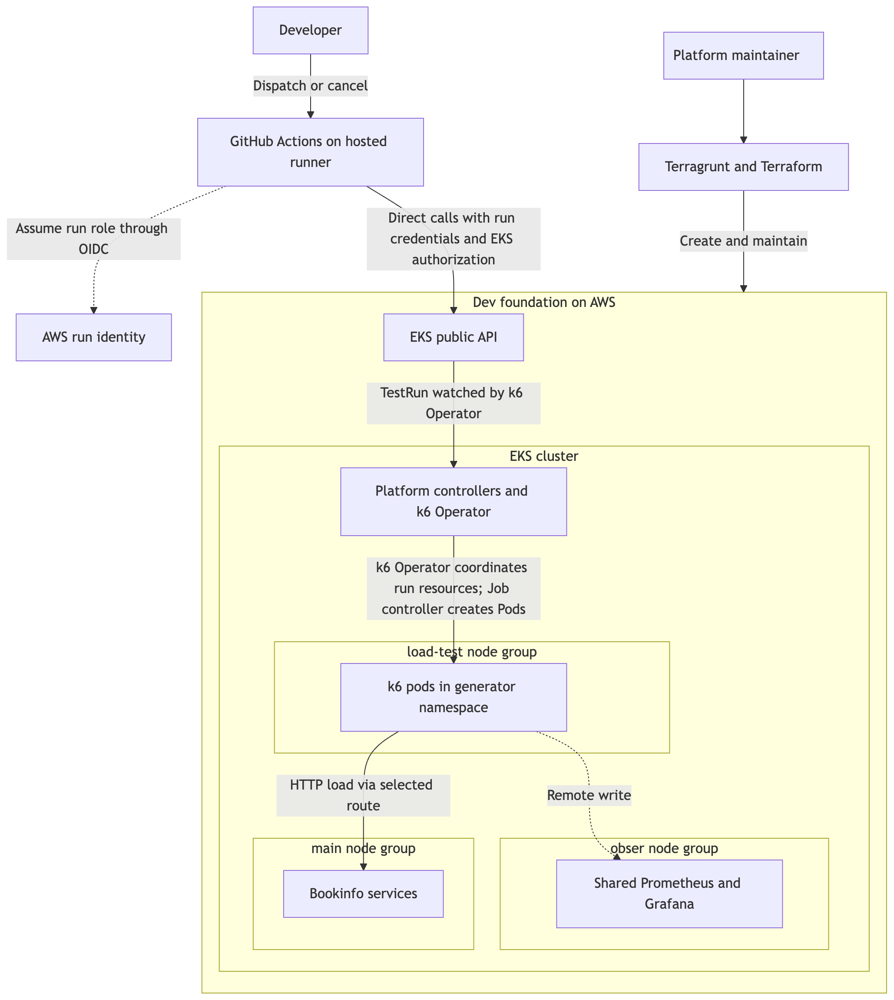
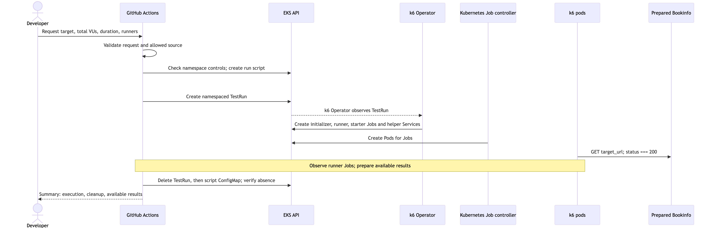
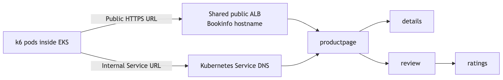
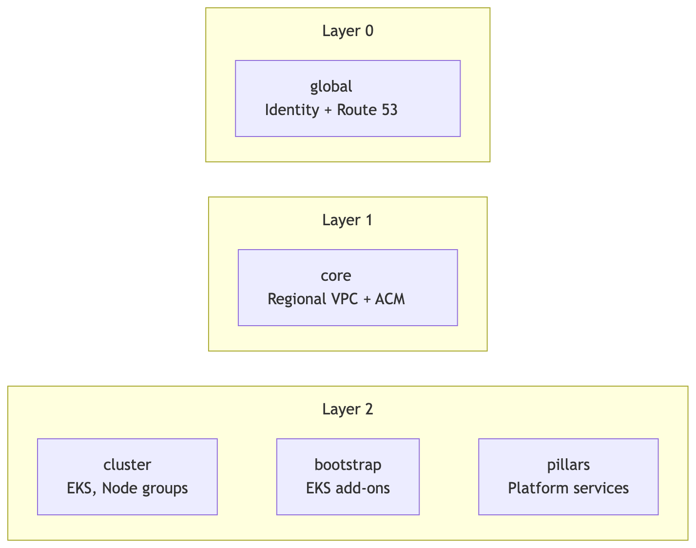
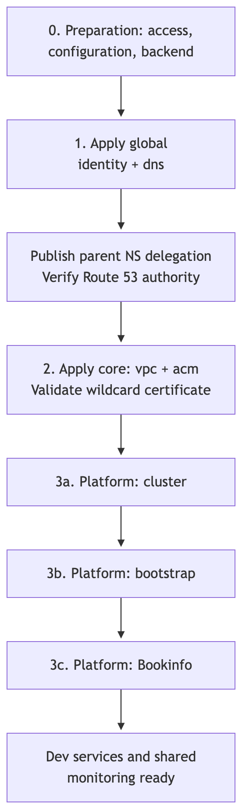
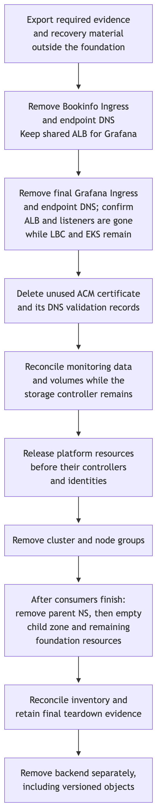

# Architecture

- [1. System overview and boundaries](#1-system-overview-and-boundaries)
- [2. One load-test run](#2-one-load-test-run)
- [3. AWS deployment and capacity](#3-aws-deployment-and-capacity)
- [4. Infrastructure layers and foundation lifecycle](#4-infrastructure-layers-and-foundation-lifecycle)
- [5. Access and operating limits](#5-access-and-operating-limits)

This design runs temporary k6 workloads against an existing Dev deployment. GitHub Actions handles the request and reports its outcome; EKS runs the generators, Bookinfo and shared monitoring.

> Status: The final demo is complete and accepted. [Validation](validation.md#acceptance-coverage) records the demonstrated AWS flow, independent Git-clone checks along with Viewer results and four videos.

The [specification](specification.md) defines required behavior and acceptance checks. Deployment commands are in [setup](setup.md); alternatives and trade-offs are in the [writeup](../WRITEUP.md).

## 1. System overview and boundaries

- [Components and responsibilities](#components-and-responsibilities)
- [What stays between runs](#what-stays-between-runs)

### Components and responsibilities

The platform maintainer prepares Bookinfo, its real dependencies and the shared infrastructure before testing. Developers request tests through GitHub Actions using their Git identity, without a personal kubeconfig or an infrastructure ticket for each run. Authorized team members can view results and cancel group runs.

The diagram separates foundation work from each load-test run. GitHub Actions creates a TestRun through the EKS API; k6 Operator starts the generators. They send metrics to Prometheus, which Grafana queries for results.

This workflow assumes a trusted team and reviewed default-branch code. Runs share the `k6-runners` namespace. The `load-test` node group provides their compute capacity; namespace and node group are separate boundaries. Their enforcement limits are described under [access and operating limits](#5-access-and-operating-limits).

### What stays between runs

| Resource group | Owner | Lifetime |
|---|---|---|
| Network, EKS/node groups, ALB/DNS/TLS, controllers, Bookinfo, monitoring and Terraform state | Platform maintainer | Across tests, until foundation teardown |
| Generator namespace, ServiceAccounts and access rules | Foundation bootstrap | Across tests |
| TestRun, script ConfigMap, generated Jobs, Pods and helper Services | Run workflow | One run attempt |

Run cleanup preserves other runs, shared services and data, monitoring volumes and retained results. It must never reset a shared database, flush a shared cache or purge a shared queue. The foundation continues to cost money between tests. Its final removal is a separate task for the platform maintainer.

## 2. One load-test run

- [Request a test](#request-a-test)
- [Start the runners](#start-the-runners)
- [Send traffic](#send-traffic)
- [Read the results](#read-the-results)
- [End the run](#end-the-run)

The sequence follows one request through execution, reporting and cleanup. The workflow observes runner outcomes before deleting their Kubernetes Jobs.

### Request a test

The target and its dependencies must already be ready. The developer selects `test_scenario` (initial and default option `bookinfo.js`), supplies the complete `target_url`, then sets the load inputs which must satisfied the [input policy](../config/load-test-policy.json):

| Input | Default | Accepted range |
|---|---:|---:|
| Total concurrent VUs | 20 | 20 to 1,000 |
| Load duration | 60 seconds | 60 to 18,000 seconds |
| Runner count | 2 | 2 to 10 |

All three inputs are integers. Total VUs are split across runners; adding runners does not multiply the requested load. These bounds are configuration limits, not verified capacity.

The workflow and JavaScript workload use the same default-branch commit resolved at dispatch and keep it throughout the run. Developers cannot select a separate workload ref or supply Kubernetes manifests.

The selected filename resolves directly to `load-tests/<test_scenario>` in that checkout. The [request validator](../scripts/load-test-request-validation.py) checks the filename and requires a regular, non-symlink file. The Summary records the filename, target URL and both source SHAs. [Scenario registration](setup.md#add-a-test-scenario) adds the script and dropdown option in the same commit.

Twelve Repository Variables supply deployment settings and repository identity. Missing or invalid values reject the request before AWS credentials. These settings live outside Git, so a rerun may use values changed since the original commit.

### Start the runners

The [load workflow](../.github/workflows/load-test.yml) generates the native ConfigMap and explicitly creates each run's resources. The shared [TestRun template](../load-tests/test-run.yaml) defines image pins and Pod controls across scenarios; the [input policy](../config/load-test-policy.json) owns numeric bounds.

The [lifecycle module](../scripts/load-test-lifecycle.py) records creation intent and server-returned UIDs. These records let cleanup handle partial failures without deleting an occupied or replaced name. It also observes outcomes and finalizes the run.

Observation uses a normal cancellable workflow step. Finalization reports and cleans up under `always()` without resuming observation. k6 Operator owns the generated Jobs and helper Services.

`runId = GITHUB_RUN_ID-GITHUB_RUN_ATTEMPT` identifies the attempt in object names, metrics and the Summary. Cleanup tracks object names and UIDs as well; labels alone do not establish ownership.

### Send traffic

Bookinfo supplies four real services with built-in synthetic data. `productpage` calls `details` and `review`; `review` calls `ratings`. The local `review` service uses the upstream `reviews-v2` image. Each service has one replica and configured resources, with no HPA, Istio, application database, cache or queue.

Productpage's fixed load-test baseline is `1000m` CPU / `1024Mi` for both requests and limits, owned by its [chart defaults](../infra/terraform-modules/bookinfo/charts/productpage/values.yaml). Comparison runs keep resources and thresholds unchanged to measure what this baseline supports.

The Bookinfo URLs end in `/productpage` and exercise these network paths. Replace the example public hostname with the deployed hostname.

| Network path | Example target | What the path includes |
|---|---|---|
| Public | `https://bookinfo.demo.example.com/productpage` | Generator egress through NAT, public ALB, ingress and application dependencies |
| Internal | `http://productpage.bookinfo.svc.cluster.local/productpage` | Cluster networking and application dependencies; bypasses the ALB and NAT |

Supply the complete `target_url`, including its path and any query. Validation applies these rules:

- Accept HTTP or HTTPS for the target URL. The URL must have a DNS hostname and may have a valid port.
- Preserve the supplied URL exactly, without adding a path.
- Reject malformed URLs or percent escapes, credentials, fragments, raw whitespace/control characters, backslashes, invalid ports and IP literals.

URL validation has no destination allowlist and does not classify public/private DNS resolution. The requester must have permission to test the destination.

The `bookinfo.js` script sends one GET to `TARGET_URL` unchanged and checks only `status === 200`. VUs repeat without deliberate sleep. This is constant concurrency, so achieved request rate depends on response time. HTTP 200 can hide a failed downstream call; the workload does not prove complete page correctness.

### Read the results

The developer receives a GitHub Actions Summary and a Grafana link filtered to the run and measurement interval. The Summary retains the run ID, selected scenario, target URL, load configuration, source SHAs, interval, execution status, known data gaps and cleanup status.

| Result | Interpretation |
|---|---|
| Execution | Expected runner Job outcomes, including native k6 threshold failures |
| Performance | Developer assessment of latency, achieved throughput and HTTP outcomes in Grafana |
| Cleanup | Whether all tracked run-owned objects were removed |

Fixed workload thresholds evaluate **each runner's own observations**: request-duration p95 below 1 second and HTTP 200 success of at least 99%. Transport failures count as unsuccessful requests. Request duration excludes initial DNS lookup and connection establishment. These are demo diagnostics, not production SLOs or assignment-prescribed targets.

Threshold breaches do not abort the requested load or stop other runners early. A failed runner makes execution fail. Workflow success requires every expected runner Job to succeed, the Summary to be published and cleanup to be verified. Missing runner outcomes mean incomplete execution.

A green workflow does not establish a whole-run performance verdict or complete telemetry. Absent metrics cannot mean zero failures. Automated whole-run evaluation remains future work [another-week improvement](../WRITEUP.md#with-another-week).

k6 sends metrics directly to internal Prometheus through remote write with native histograms. Grafana queries Prometheus, without an intermediate collector. The [monitoring values](../infra/terraform-modules/platform-bootstrap/modules/kube-prometheus-stack/values.override.yaml) deploy unmodified upstream dashboard 18030, revision 8.

Deployment reconciliation, live Viewer access and the fixed-time Summary link after cleanup have passed. The dashboard's VU averaging and check-rate rounding are accepted display limitations. Exhaustive numerical fixtures and custom query corrections are outside acceptance; see [validation](validation.md#current-local-implementation-checks).

Read distributed results with these limits:

- Every runner uses the same `run_id` and matching `testid` dashboard alias, with a distinct `instance_id`. Pass these run tags through TestRun arguments because k6 Operator CLI tags override tags set only in the script.
- A combined latency percentile requires merged histograms; combined HTTP outcomes require request-weighted counts/rates. Averaging runner percentiles or success percentages does not establish a whole-run result.
- Distinguish rolling-window panels from whole-run values. Missing data stays unknown, including an upstream failure panel with no data; it is not zero or PASS.

Metrics remain available within Prometheus retention and storage limits; Summary retention follows repository settings. The workflow uploads no downloadable artifacts and retains no k6 logs or stdout summaries after cleanup. GitHub execution logs are separate. Retaining k6 logs in Loki or an existing logging system is an optional improvement [another-week improvement](../WRITEUP.md#with-another-week).

### End the run

k6 Operator automatic cleanup stays disabled so the workflow can first observe all expected runner outcomes and prepare available results. It then deletes the TestRun and generated resources, deletes the script ConfigMap separately, and verifies that every tracked object is gone.

The workflow publishes one Summary after recording cleanup status. A ConfigMap reference does not make it a child of the TestRun.

A deliberate workflow rerun creates new load under a new attempt ID. A cleanup retry uses the original names and UIDs and creates no load. Failed tests are not automatically replayed.

| Phase | Budget |
|---|---|
| Preparation and runner readiness, including capacity waits | 15 minutes |
| Load | Requested duration `D` |
| Finish in-flight iterations | 30 seconds |
| Observe outcomes, report and clean up | 5 minutes total |
| Hard job timeout | `ceil(D / 60) + 25` minutes; maximum 325 minutes |

Cancellation, timeout or execution failure must stop traffic, preserve the original outcome and available results, and attempt scoped cleanup. Active cancellation, preservation of a parallel run, and repeated recovery using original UIDs have AWS evidence. Controlled local checks cover timeout and other failure cases; they do not establish hosted timeout behavior.

A lost or force-cancelled GitHub runner can leave resources behind. The hard timeout does not remove Kubernetes objects. Manual recovery removes tracked objects without starting new load; there is no independent sweeper.

The workflow starts its preparation timer before checkout and Python setup. Those steps share the 15-minute deadline. Local cross-process checks and hosted Ubuntu execution verified the timer handoff; an actual hosted timeout was not exercised.

## 3. AWS deployment and capacity

- [Network and endpoints](#network-and-endpoints)
- [Compute and scaling](#compute-and-scaling)
- [Monitoring storage](#monitoring-storage)

### Network and endpoints

The demo uses one AWS account in Singapore (`ap-southeast-1`). EKS exposes public and private API endpoints. GitHub-hosted runners orchestrate through the public endpoint; k6 traffic originates from Pods inside EKS.

The VPC has two public and two private subnets across two Availability Zones. Worker nodes have no public IPs and use one shared NAT Gateway for internet access. The ALB uses both public subnets, with separate Bookinfo and Grafana hostnames sharing one IngressGroup and regional wildcard certificate.

One NAT Gateway limits availability and shares egress capacity between public-target load and other private-subnet workloads. Dedicated generator egress remains future work. Internal Service traffic follows the [cluster-only path](#send-traffic).

### Compute and scaling

| Node group | Workloads | Instance | Initial / minimum / maximum nodes |
|---|---|---|---|
| `main` | Bookinfo, platform controllers and general workloads | `t3a.medium` | 1 / 1 / 2 |
| `obser` | Prometheus and Grafana | `t3a.medium` | 1 / 1 / 2 |
| `load-test` | k6 initializer, starter and runner Pods | `t3a.large` | 1 / 1 / 10 |

Node selectors, taints and tolerations keep generators on different hosts from the application. `main` and `load-test` can use both private subnets; an initial size of one does not place a node in each AZ. `obser` stays in one private subnet so replacement nodes can use its EBS volumes.

Each k6 runner requests 500m CPU / 512 MiB, with limits of 1 CPU / 1 GiB. The shared TestRun template also pins initializer/starter images and resources. Cluster Autoscaler adjusts node capacity within the group bounds.

The ten-node generator ceiling is shared across runs, with no aggregate concurrent-run or VU cap. It neither guarantees load capacity nor caps the AWS bill. CPU-credit behavior uses the AWS default.

At the fixed Productpage baseline, 60-second runs with two runners passed at 20 VUs on both routes and at 40 VUs internally. The internal 80-VU run failed latency. These short samples do not establish sustained or maximum capacity.

### Monitoring storage

Prometheus and Grafana use separate gp3 volumes on `obser`, initially 20 GiB and 1 GiB. They retain metrics and Grafana's local database across run cleanup. Monitoring can be interrupted during node replacement and becomes unavailable during an outage of its AZ.

The EBS CSI driver manages these volumes. The default StorageClass waits for scheduling before creating a volume and uses reclaim policy `Delete`: deleting a monitoring PVC can delete its volume. Pod-recreation persistence has evidence; node-replacement recovery remains unverified. Final foundation teardown ends access to in-cluster results.

## 4. Infrastructure layers and foundation lifecycle

- [Layers and state boundaries](#layers-and-state-boundaries)
- [Module composition and shared configuration](#module-composition-and-shared-configuration)
- [DNS and ingress ownership](#dns-and-ingress-ownership)
- [Foundation bootstrap](#foundation-bootstrap)
- [Foundation teardown](#foundation-teardown)

### Layers and state boundaries

Terragrunt connects Terraform units with separate state. Global holds account-wide resources; Core and Platform hold regional resources. Platform separates the EKS cluster, shared services installed into it, and application pillars.

The demo has seven units:

| Layer / unit | Owned resources and downstream interface |
|---|---|
| Global / `identity` | Shared GitHub OIDC provider |
| Global / `dns` | Delegated Route 53 zone and nameservers |
| Core / `vpc` | VPC, routing, subnets and NAT; network IDs |
| Core / `acm` | Wildcard certificate and DNS validation; validated certificate ARN |
| Platform / `cluster` | EKS, node groups, managed add-ons, platform maintainer access and EBS CSI identity; connection details |
| Platform / `bootstrap` | Controllers, generator namespace, workflow access and monitoring; release, access and endpoint references |
| Platform / `pillars/bookinfo` | Application namespace and four service releases |

Bootstrap consumes the five upstream units. Bookinfo consumes the prepared platform. References and dependency ordering do not prove readiness; live checks still determine whether the next operation can proceed.

### Module composition and shared configuration

Suitable public Terraform modules are preferred. Local modules under `infra/terraform-modules/` compose the cluster, bootstrap and Bookinfo:

- Each bootstrap addon has its own child module; all share one state. The [bootstrap addon ADR](decisions/0007-bootstrap-addon-modules.md) explains this boundary.
- Bookinfo has four service children/charts and a shared library in one pillar state. Chart defaults describe each service; Terraform renders deployment overrides. The [Bookinfo chart ADR](decisions/0008-bookinfo-service-charts.md) explains the packaging.

The [README tree](../README.md#infrastructure-layers) shows the layout.

Shared Terragrunt configuration owns provider settings, tags and S3 state: encrypted, versioned, public access blocked, native locking and distinct keys per unit. The [naming and state ADR](decisions/0006-aws-resource-naming-and-state-layout.md) explains resource prefixes, state addresses and generated-name exceptions.

Environments map to separate accounts; regional paths separate resources within an account. Only Dev/Singapore is demonstrated. Module sources are local; published immutable releases are outside this demo.

Platform defaults keep tested add-on versions together. An explicit cluster add-on map replaces the whole default bundle, so omitted entries and their owned IAM resources can be removed. Version changes require compatibility checks and a reviewed plan.

The [decision index](decisions/README.md) gives the reading order for all accepted choices. The main design decisions are:

- [Dev services and dependencies (0001)](decisions/0001-existing-dev-services-and-dependencies.md): prepared targets, real dependencies, data ownership and result limits.
- [EKS (0002)](decisions/0002-eks-execution-platform.md): platform choice, compute separation and network/storage trade-offs.
- [k6 Operator (0003)](decisions/0003-k6-operator-load-generator.md): generator alternatives, distributed results and run ownership.
- [GitHub Actions (0004)](decisions/0004-github-actions-self-service-workflow.md): developer interface, runner location, access boundaries and workflow lifecycle.
- [Terragrunt (0005)](decisions/0005-terragrunt-iac-orchestration.md): layer boundaries, module policies and accepted trade-offs.

### DNS and ingress ownership

The shared endpoint setup crosses these units, with a separate owner for each resource:

| Owner | Responsibility |
|---|---|
| Global DNS and platform maintainer | Terraform creates the delegated public Route 53 zone; the platform maintainer adds parent NS delegation |
| Core ACM | Regional wildcard certificate and DNS validation records |
| Bookinfo and monitoring | Ingresses that consume the validated certificate ARN |
| AWS Load Balancer Controller | Creates and reconciles the shared ALB; publishes its address in Ingress status |
| ExternalDNS | Uses Ingress hostnames/status to manage endpoint aliases and TXT ownership records in the delegated zone |

Terraform and ExternalDNS manage different DNS records. Parent delegation must work before ACM validation can finish.

### Foundation bootstrap

The normal setup has **three apply invocations: Global, Core, Platform**. Platform orders cluster, bootstrap and Bookinfo internally; all seven unit states remain separate. Backend creation and parent DNS delegation are separate setup steps.

The diagram shows six logical stages, including preparation and the three units inside Platform:

Within bootstrap, install ALB Controller, Cluster Autoscaler, ExternalDNS, Metrics Server, k6 Operator and monitoring in dependency order. Check controller access, scheduling, storage and endpoints before load. If setup fails, retain resources and state for diagnosis and retry.

An offline fixture verifies the grouped Terragrunt ordering. Recorded foundation checks and later source/deployment reconciliation cover their named revisions. Repeating blank-account bootstrap or exercising the grouped Platform command on a fresh foundation is outside the final demo scope and has no execution evidence here.

### Foundation teardown

Foundation teardown is outside the completed demo and was not exercised. The procedure below applies to a separately authorized maintainer operation.

Export required evidence and recovery material before dismantling the foundation. Removal follows dependencies: cleanup controllers and their permissions must remain available until the resources they manage are gone.

1. Stop new runs, finish or cancel active ones, and verify generator cleanup.
2. Remove Bookinfo and Grafana ingress exposure while ALB Controller and ExternalDNS remain available. Confirm the ALB, target groups and endpoint ownership records are removed. Remove ACM only after listener associations are gone.
3. Decide what monitoring data to retain, then remove selected PVCs/volumes while EBS CSI and Pod Identity still work.
4. Remove remaining bootstrap components and workflow access, then cluster, Core and Global resources. Remove parent NS delegation before deleting the empty child zone. Keep independent platform maintainer access until recovery is no longer needed.
5. Reconcile leftovers and retire the versioned state backend separately, last.

Uninstalling the k6 Operator Helm release alone leaves Terraform-managed workflow IAM/EKS access in place. Remove the EKS access entry before its role; verify that new workflow access is denied after propagation. This does not stop existing Pods or instantly revoke issued sessions.

The [setup guide](setup.md#remove-the-foundation) documents the maintainer procedure. The [validation record](validation.md#foundation-and-infrastructure) records its evidence status and submission scope.

## 5. Access and operating limits

- [Human access](#human-access)
- [Workflow access](#workflow-access)
- [Controller and runner identities](#controller-and-runner-identities)
- [Enforcement limits](#enforcement-limits)

### Human access

- **Platform maintainer:** uses independent AWS/EKS administrator credentials to deploy, update and recover the foundation. Manages Grafana accounts with a separate administrator account.
- **Developers:** use local Grafana accounts with the `Viewer` role over public HTTPS. Anonymous access and self-registration are disabled.

Prometheus ingestion and queries remain internal.

### Workflow access

Bootstrap prepares workflow access before any test. Authentication and authorization follow three steps:

1. **Get AWS credentials through OIDC.** GitHub Actions assumes the run IAM role. Its trust policy accepts only the configured repository and default branch, with AWS STS as the expected token audience.
2. **Identify the workflow to EKS.** The IAM role can read this cluster's connection details through `eks:DescribeCluster`. An EKS access entry maps that role to a Kubernetes group.
3. **Apply namespace permissions through RBAC.** A RoleBinding gives the group permission to create TestRuns and script ConfigMaps, then observe and clean up run resources in the generator namespace.

The job requests one six-hour AWS session. AWS CLI renews EKS authentication tokens while that session remains valid.

Workflow permissions exclude changes to namespaces, ServiceAccounts, RBAC, and Bookinfo/monitoring resources. GitHub Actions does not manage foundation state.

Genuine GitHub OIDC, IAM-to-EKS authentication and token renewal have runtime evidence, alongside deployed access metadata and Kubernetes permission checks. Integration access removal was not exercised and is outside this demo.

### Controller and runner identities

These components use identities separate from the GitHub Actions role:

| Component | Access |
|---|---|
| AWS controllers, including EBS CSI | EKS Pod Identity provides IAM permissions scoped to the AWS resources they manage |
| VPC CNI | Uses the node IAM role |
| k6 Operator | Uses its own Kubernetes ServiceAccount and chart RBAC to reconcile TestRuns and create Jobs and helper Services |
| k6 run Pods | Use the generator namespace's default ServiceAccount, with no extra API grants and token mounting disabled |

Role ownership follows the [infrastructure layers](#layers-and-state-boundaries): the cluster unit owns EBS CSI and its Pod Identity role; bootstrap owns the other AWS controller roles.

### Enforcement limits

- **k6 Operator scope:** its chart RBAC grants access beyond the watched namespace. Watching one namespace does not reduce those permissions.
- **Run isolation:** namespace RBAC cannot enforce ownership between runs or validate arbitrary TestRun/Pod fields. Trusted workflow templates must enforce placement, resource bounds and object selection.
- **Optional controls:** custom admission policies and generator NetworkPolicy are [another-week improvements](../WRITEUP.md#with-another-week).

The [compute limits](#compute-and-scaling) bound individual runners and node groups; the [cleanup procedure](#end-the-run) tracks each attempt's resources.

Shared Dev traffic and deployments can affect measurements. Actual workflow runs verify active cancellation, parallel-run preservation and recovery. Hosted timeout faults, sustained capacity waits and integration removal were not exercised and are outside the final demo scope.
