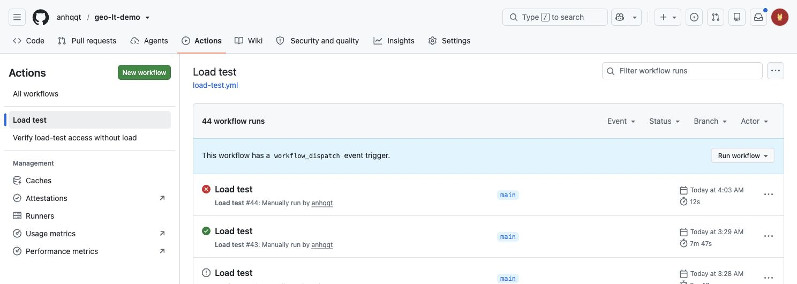
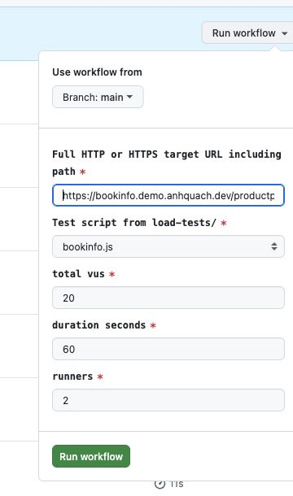
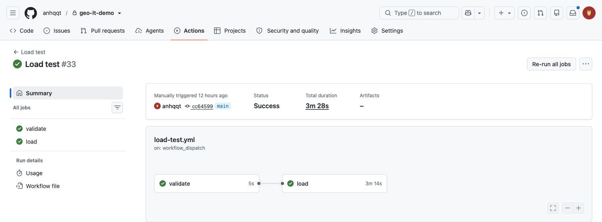
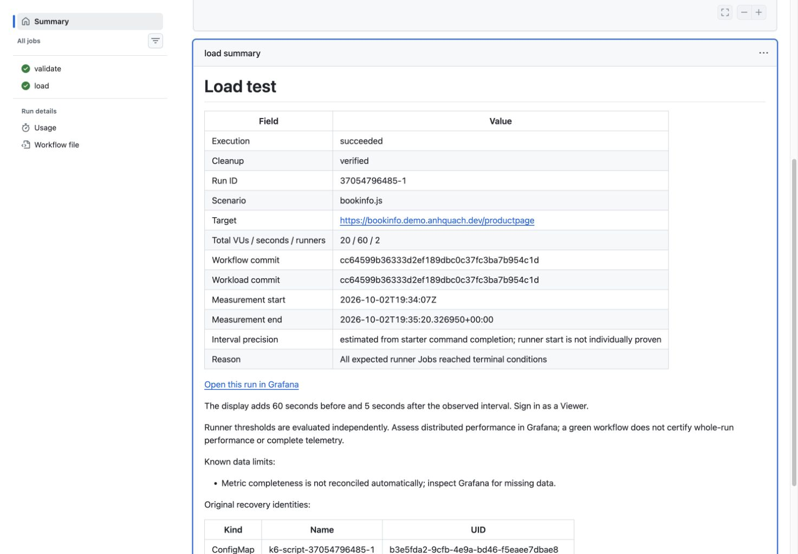

# Set up the AWS foundation

- [TL;DR: run the demo](#tldr-run-the-demo)
- [Prerequisites](#prerequisites)
- [Deploy the foundation](#deploy-the-foundation)
- [Verify the setup](#verify-the-setup)
- [Prepare workflow access](#prepare-workflow-access)
- [Dispatch run and read a run result](#dispatch-run-and-read-a-run-result)
- [Add a test scenario](#add-a-test-scenario)
- [Recover the original run](#recover-the-original-run)
- [Remove the foundation](#remove-the-foundation)

Deploy the shared infrastructure, Bookinfo and monitoring before running load tests. The intended path uses **three apply commands: Global → Core → Platform**, with seven separate Terraform states.

> The published demo is complete and accepted. Independent Git-clone checks and hosted execution used the retained Dev foundation. Global and Core have recorded grouped applies; a fresh grouped Platform deployment or repeated blank-account bootstrap was not exercised. See [validation](validation.md) for the evidence and its limits.

Use Productpage with `1000m` CPU / `1024Mi` requests and limits, and `obser` nodes of type `t3a.medium` for capacity comparisons. Keep this baseline fixed across comparison runs.

After applying the [Productpage chart values](../infra/terraform-modules/bookinfo/charts/productpage/values.yaml) and cluster configuration, confirm the deployed Pod resources, and Observability is ready. See [validation](validation.md) for measured results and limits.

## TL;DR: run the demo

To save setup time, I have prepared `anhqqt/geo-lt-demo` and deployed the AWS resources it needs. You can use this environment to review the full load-test workflow, from starting a run to viewing results and checking cleanup.

I will keep the AWS foundation running for seven days for the assignment review, then tear it down. Bookinfo, Grafana and load-test execution in this environment will be unavailable after teardown.

The GitHub repository will be public during the same seven-day review period so you can browse the code and workflow. I will make it private afterward to limit ongoing public access.

- **Grafana:** [grafana.demo.anhquach.dev](https://grafana.demo.anhquach.dev). Admin and Viewer credentials were sent by email. Use Viewer to inspect test results.
- **Bookinfo:** Open [the Productpage](https://bookinfo.demo.anhquach.dev/productpage) to browse the demo application.

### 1. Open the workflow

Sign in to GitHub and open [anhqqt/geo-lt-demo](https://github.com/anhqqt/geo-lt-demo). Select **Actions**, then **Load test** in the left sidebar.



### 2. Enter the test settings

Click **Run workflow** and keep **Branch: main**. Use these example values to test Bookinfo through its public HTTPS endpoint:

| Input | Value |
|---|---|
| Full HTTP or HTTPS target URL including path | `https://bookinfo.demo.anhquach.dev/productpage` |
| Test script from load-tests/ | `bookinfo.js` |
| total vus | `20` |
| duration seconds | `60` |
| runners | `2` |

The 20 VUs are shared across two runners. Click the green **Run workflow** button to start the test.



### 3. Follow your run

Open the new **Load test** entry in the run list; refresh if it has not appeared. Check the actor and start time to identify your run. The page shows the **validate** and **load** jobs; click either job to inspect its logs.

Queueing, preparation and cleanup add time beyond the 60-second load period.



*The result screenshots show the recorded [run #33](https://github.com/anhqqt/geo-lt-demo/actions/runs/37054796485), using the same example values.*

### 4. Read the results

On **Summary**, scroll to **load summary**. Read **Execution** and **Cleanup** separately, then click **Open this run in Grafana** when available. Sign in as a Viewer to inspect that run's metrics.



A green workflow does not establish whole-run performance; missing metrics do not mean zero errors. Run cleanup leaves the shared AWS foundation running and incurring costs.

For your own AWS environment, complete [Prerequisites](#prerequisites), [Deploy the foundation](#deploy-the-foundation), [Verify the setup](#verify-the-setup) and [Prepare workflow access](#prepare-workflow-access) first. Then follow the same UI steps in your repository, using its default branch and Bookinfo URL.

## Prerequisites

- [Tools](#tools)
- [Account and project settings](#account-and-project-settings)

You need a dedicated Dev AWS account, platform maintainer permissions to create the foundation, and a subdomain whose parent DNS you can edit. This guide uses project `geo-lt`, environment `dev` and region `ap-southeast-1`.

EKS, nodes, NAT, the ALB and storage continue to cost money between tests. Removing them is a separate step.

### Tools

| Tool | Version | Basis |
|---|---|---|
| Terraform | `1.16.4` | Repository pin |
| Terragrunt | `1.1.6` | Repository pin |
| Helm CLI | `4.3.0` | Recorded Bookinfo checks; used by chart build hooks |
| kubectl | `1.37.1` | Recorded checks against EKS `1.36` |
| AWS CLI | v2 (`2.37.4` checked locally) | Deployment record specifies v2 without an exact pin |
| Bash | `3.2+` | Commands below |

Also install Git, GitHub CLI, `curl`, `dig` and Python 3.10 or newer for manual cleanup/recovery. The runtime scripts use only the Python standard library.

The hosted workflows pin Python 3.12.15 and install kubectl 1.36.5 through [Azure/setup-kubectl](https://github.com/Azure/setup-kubectl) at a fixed action commit. They use the AWS CLI v2 [included in the standard Ubuntu 24.04 runner image](https://github.com/actions/runner-images/blob/main/images/ubuntu/Ubuntu2404-Readme.md#cli-tools), whose version follows runner-image updates. Each run records the kubectl and AWS CLI versions.

Check that your PATH selects the intended versions.

Start at the repository root in a checkout containing `infra/`. Run the commands in order, using the same terminal, and stop if a command fails.

With [tfenv](https://github.com/tfutils/tfenv) and [tgenv](https://github.com/tgenv/tgenv) installed:

```bash
tfenv install 1.16.4
tfenv use 1.16.4
tgenv install 1.1.6
tgenv use 1.1.6

terraform version
terragrunt --version
helm version --short
kubectl version --client
aws --version
```

On macOS, `brew install tfenv tgenv` installs the managers. Standalone binaries at the pinned versions work too.

### Account and project settings

Replace the profile and account ID below with your own. Log in through your usual AWS CLI method first, then confirm that STS returns the expected account and maintainer ARN.

```bash
export AWS_PROFILE=your-dev-profile
export AWS_ACCOUNT_ID=123456789012
export AWS_REGION=ap-southeast-1

aws sts get-caller-identity
```

Edit these settings for your AWS environment and repository. Replace `demo.example.com` throughout this guide with a subdomain you control.

| File | Field | Example value |
|---|---|---|
| `infra/live/dev/env.hcl` | `locals.dns_zone_name` | `"demo.example.com"` |
| `infra/live/dev/ap-southeast-1/platform/bootstrap/terragrunt.hcl` | `inputs.k6_operator.github_oidc_subject` | `"repo:OWNER/REPO:ref:refs/heads/main"` |
| `infra/live/dev/ap-southeast-1/region.hcl` | `locals.vpc_cidr` | `"10.40.0.0/16"` |
| `infra/live/dev/ap-southeast-1/region.hcl` | `locals.public_subnet_cidrs` | `["10.40.0.0/24", "10.40.1.0/24"]` |
| `infra/live/dev/ap-southeast-1/region.hcl` | `locals.private_subnet_cidrs` | `["10.40.16.0/20", "10.40.32.0/20"]` |

Set the delegated zone name once in `env.hcl`. The DNS unit reads `locals.dns_zone_name` through the shared root configuration; the certificate and ingress hosts use the DNS unit's output.

For OIDC, use the exact subject for your repository's default branch, including immutable owner/repository IDs if enabled. Run the access workflow to verify OIDC authentication for your repository and deployment.

Keep the subnet ranges inside the VPC CIDR and separate from each other, which should fit your current AWS environment. 

## Deploy the foundation

- [Prepare shared state](#prepare-shared-state)
- [1. Global: identity and DNS](#1-global-identity-and-dns)
- [2. Core: VPC and certificate](#2-core-vpc-and-certificate)
- [3. Platform: cluster, bootstrap and Bookinfo](#3-platform-cluster-bootstrap-and-bookinfo)

### Prepare shared state

If this account already contains a matching backend, hosted zone or GitHub OIDC provider, check its ownership and Terraform state before continuing.

From the repository root, create the S3 backend once:

```bash
terragrunt --working-dir infra/live/dev/global/identity backend bootstrap
```

The shared configuration defines the bucket, encryption, versioning and state locking.

### 1. Global: identity and DNS

Move into the Global layer and review the plan. Expect one GitHub OIDC provider and one public hosted zone.

```bash
cd infra/live/dev/global
terragrunt run --all -- plan -out=setup.tfplan
```

After reviewing both unit plans, run **apply 1**:

```bash
terragrunt run --all -- apply setup.tfplan
terragrunt --working-dir dns run -- output -json name_servers
```

`run --all` selects the layer's units and follows their dependency order. Terragrunt asks for one queue confirmation and auto-approves each underlying Terraform command. Check the displayed queue before confirming. See [Terragrunt's run queue](https://docs.terragrunt.com/features/stacks/run-queue/).

**Delegate DNS before Core.** At your parent DNS provider, add an NS record set for the subdomain using all four returned nameservers.

```bash
dig +trace NS demo.example.com
dig @1.1.1.1 +short NS demo.example.com
```

Continue when the parent delegation and public answer match the new zone. ACM needs this to validate the certificate. If the previous delegation used DNSSEC, remove any stale parent DS record.

### 2. Core: VPC and certificate

From the Global directory, move into Core. Expect a VPC with public/private subnets, one NAT Gateway and a wildcard certificate for your subdomain.

```bash
cd ../ap-southeast-1/core
terragrunt run --all -- plan -out=setup.tfplan
```

Review the `vpc` and `acm` plans, then run **apply 2**:

```bash
terragrunt run --all -- apply setup.tfplan
```

ACM waits for DNS validation, up to 45 minutes. Confirm that the certificate is `ISSUED` in the ACM console before continuing.

### 3. Platform: cluster, bootstrap and Bookinfo

Check the regional EC2 Standard On-Demand quota first. The initial three nodes need **6 available vCPUs**, after existing usage. The configured node-group maximum needs 28.

```bash
aws service-quotas get-service-quota --service-code ec2 --quota-code L-1216C47A --query Quota.Value --output text
```

If the quota is too small, request an increase and wait for approval.

**Deployment limit:** this grouped Platform command was not exercised on a fresh AWS foundation. The recorded deployment and source checks are described in [validation](validation.md#later-source-checks).

The dependency order is cluster → bootstrap → Bookinfo. Before the first deployment, a full Platform plan cannot resolve outputs from the cluster that does not exist yet.

From Core, move into Platform and run **apply 3**. This command plans and applies each unit without a separate plan approval between units. Review the configuration and queue first.

```bash
cd ../platform
terragrunt run --all -- apply
```

Expect EKS with `main`, `obser` and `load-test` node groups, six bootstrap addons, shared monitoring, the persistent `k6-runners` namespace and four Bookinfo services.

If an apply fails, keep the successful units and their state. Fix the failed unit and review a fresh plan before retrying. Recovery may need additional commands; three applies describe the intended successful path.

## Verify the setup

- [Cluster and workloads](#cluster-and-workloads)
- [Bookinfo and Grafana](#bookinfo-and-grafana)

### Cluster and workloads

Connect kubectl to the cluster. `update-kubeconfig` selects this cluster as the current context.

```bash
aws eks update-kubeconfig --name geo-lt-dev-apse1-main --region ap-southeast-1
kubectl get nodes -L workload
kubectl get pods -A

for service in ratings details review productpage; do
  kubectl -n bookinfo rollout status "deployment/$service" --timeout=300s
done
```

Expect Ready nodes in all three groups, all containers ready in controller and monitoring Pods, successful Bookinfo rollouts and no run Pods in `k6-runners`. Wait for startup to finish; investigate Pods that stay Pending or restart repeatedly before testing.

### Bookinfo and Grafana

Use the subdomain you configured earlier:

```bash
curl --fail --silent --show-error --output /dev/null --write-out 'Bookinfo HTTP %{http_code}\n' https://bookinfo.demo.example.com/productpage
curl --fail --silent --show-error https://grafana.demo.example.com/api/health
```

Expect Bookinfo HTTP 200 and Grafana health reporting a working database. Open Bookinfo and check that it shows details, reviews and ratings. These smoke checks do not establish load capacity or complete dependency correctness.

Read Grafana's generated login locally. These commands print credentials; keep the output out of logs, recordings and commits.

```bash
kubectl -n monitoring get secret monitoring-grafana -o jsonpath='{.data.admin-user}' | base64 --decode
printf '\n'
kubectl -n monitoring get secret monitoring-grafana -o jsonpath='{.data.admin-password}' | base64 --decode
printf '\n'
```

Sign in at `https://grafana.demo.example.com` and create Viewer accounts for developers. Check the provisioned dashboard with a Viewer account. The recorded Dev deployment passed live and post-cleanup Viewer checks; repeat them for your deployment. The upstream dashboard has display limits documented in the validation record.

From the Platform directory, check all seven units for drift:

```bash
cd ../..
terragrunt run --all -- plan
```

Expect `No changes` in every unit. Review any differences before accepting setup; output-only state reconciliation may still be needed. The [validation record](validation.md#current-workflow-verification) owns observed workflow, load and cleanup results.

## Prepare workflow access

The platform maintainer owns this step. Review current cluster, bootstrap and Bookinfo state-backed plans before load. Apply only authorized owner changes; unexpected replacement, IAM expansion or state movement stops reconciliation. Keep Bookinfo, monitoring storage and the shared ALB intact.

1. Verify the intended account, region and cluster with the independent maintainer identity. Confirm four Ready Bookinfo services and monitoring/controller readiness.
2. Return from the Dev directory to the repository root and read the non-secret deployment outputs and repository metadata. Replace `OWNER/REPO` with your repository. These commands inspect values; they do not configure GitHub variables.

```bash
cd ../../..
aws sts get-caller-identity --query Account --output text
terragrunt --working-dir infra/live/dev/ap-southeast-1/platform/cluster run -- output -raw cluster_name
terragrunt --working-dir infra/live/dev/ap-southeast-1/platform/bootstrap run -- output -json k6_operator
terragrunt --working-dir infra/live/dev/ap-southeast-1/platform/bootstrap run -- output -json kube_prometheus_stack
gh api repos/OWNER/REPO --jq '{repository: .full_name, repository_id: .id, repository_owner_id: .owner.id, default_branch: .default_branch}'
```

3. Open the repository's **Settings > Secrets and variables > Actions > Variables** and create these repository variables. This demo uses one Dev target, with no GitHub Environment. Review each value before saving it; outputs alone do not prove deployment readiness.

Example values below come from the current `anhqqt/geo-lt-demo` Repository Variables. Use your own deployment outputs and repository metadata when setting up another copy.

| Repository variable | Value to use | Example value |
|---|---|---|
| `AWS_ACCOUNT_ID` | STS account ID; must match your intended Dev account. | `254212223947` |
| `AWS_REGION` | Region configured in `region.hcl`. | `ap-southeast-1` |
| `AWS_CLUSTER_NAME` | Cluster output `cluster_name`. | `geo-lt-dev-apse1-main` |
| `AWS_ROLE_ARN` | Bootstrap: `k6_operator.workflow_role_arn`. | `arn:aws:iam::254212223947:role/geo-lt-dev-apse1-main-github-load-test` |
| `LOAD_TEST_NAMESPACE` | Bootstrap: `k6_operator.runner_namespace`. | `k6-runners` |
| `LOAD_TEST_SERVICE_ACCOUNT` | Bootstrap: `k6_operator.runner_service_account`. | `default` |
| `PROMETHEUS_REMOTE_WRITE_URL` | Bootstrap: `kube_prometheus_stack.remote_write_url`. | `http://monitoring-prometheus.monitoring.svc.cluster.local:9090/api/v1/write` |
| `GRAFANA_URL` | Bootstrap: `kube_prometheus_stack.grafana_url`. | `https://grafana.demo.anhquach.dev` |
| `LOAD_TEST_REPOSITORY` | Repository metadata: `full_name`. | `anhqqt/geo-lt-demo` |
| `LOAD_TEST_REPOSITORY_ID` | Repository metadata: numeric `id`. | `1398407508` |
| `LOAD_TEST_REPOSITORY_OWNER_ID` | Repository metadata: numeric `owner.id`. | `61163704` |
| `LOAD_TEST_DEFAULT_BRANCH` | Repository metadata: `default_branch`. | `main` |

The last four values are independent expectations checked against the dispatch source. Set them from the intended repository's metadata. Do not replace them with values derived from the dispatch event being checked.

Targets still come from the dispatch inputs; the dashboard UID stays fixed in source.

You can use GitHub CLI instead of the settings page. For example, after replacing the sample values with reviewed ones:

```bash
gh variable set AWS_CLUSTER_NAME --repo OWNER/REPO --body 'geo-lt-dev-apse1-main'
gh variable set LOAD_TEST_REPOSITORY --repo OWNER/REPO --body 'OWNER/REPO'
```

These are non-secret configuration values. Do not put AWS access keys or Grafana credentials in Repository Variables. The workflows obtain AWS credentials through OIDC and reject missing or invalid required variables before requesting them. Both workflows read the same variable names.

Variable changes are outside Git: a rerun of an older commit can use newer settings, so review the current values before rerunning.

4. Publish the reviewed workflow source to the repository's default branch after publication approval. The OIDC subject must exactly match the subject configured by bootstrap, including immutable repository and owner IDs when enabled. Keep the branch subject; a GitHub Environment would change it.
5. Run the [Verify load-test access without load](../.github/workflows/verify-load-test-access.yml) workflow while no load tests are active. It validates deployment configuration and dispatch source before credentials, then shows the caller identity and checks scoped allow/deny permissions.

   The official AWS action uses the configured OIDC trust and allowed account to obtain one six-hour STS session. API calls continue beyond 15 minutes with fresh AWS CLI exec tokens. The workflow creates and removes a private temporary kubeconfig; it creates no generators.
6. Use the Grafana Viewer account created during setup, or create one through the existing administrator UI. Verify the provisioned dashboard and result-query access without exposing credentials in recordings.

## Dispatch run and read a run result

The workflow is published and has real dispatch/load evidence in [validation](validation.md#current-workflow-verification). Obtain authorization for each target and load envelope before testing. Keep Productpage deployments and other load out of a baseline measurement window; a run overlapping a rollout does not establish stable capacity.

1. Open Actions, select [Load test](../.github/workflows/load-test.yml), choose the default branch and select `test_scenario=bookinfo.js`. Use the default `target_url=http://productpage.bookinfo.svc.cluster.local/productpage` for the internal route, or enter `https://bookinfo.demo.example.com/productpage` for your prepared public deployment.
2. Enter total VUs, duration in seconds and runners. The [input policy](../config/load-test-policy.json) sets defaults of `20`, `60`, `2` and ranges of `20..1000`, `60..18000`, `2..10`. k6 execution segments divide the total across runners, so `21` VUs with two runners is valid.

   The Bookinfo script sends one GET to the supplied `TARGET_URL` per iteration without deliberate sleep. It does not append `/productpage`; a supplied root or custom path is used as written.
3. Read the selected scenario and target in the GitHub Summary, then open its run/time-scoped Grafana link as a Viewer. Wait for the new Test ID to appear before selecting it in the live dashboard.

   HTTP failures include non-200 responses, redirects and transport failures. Native thresholds are per runner. Use the graphs for manual assessment, keeping the upstream display limits in mind. Missing data is not a zero or a pass.
4. Check execution and cleanup independently. Green requires successful expected runner Jobs, required reporting and verified removal of owned objects. Missing outcomes, failed reporting or unknown cleanup cannot produce green. Results remain in shared monitoring after generator cleanup, subject to actual retention and final teardown.

Supply the complete `target_url`, including its path and any query. HTTP and HTTPS are both accepted. The URL must have a DNS hostname and may have a valid port. The workflow preserves the supplied URL exactly without adding a path.

Validation rejects malformed URLs or percent escapes, credentials, fragments, raw whitespace/control characters, backslashes, invalid ports and IP literals. There is no destination allowlist, and URL validation does not classify whether the hostname resolves publicly or privately. The requester is responsible for permission to test it.

Starter completion supplies an estimated command-completion boundary; it cannot prove that each runner accepted unpause. The Summary labels that limitation. Job completion and deadlines still determine execution and cleanup. The dashboard does not certify metric completeness or whole-run performance.

## Add a test scenario

The demo ships only `load-tests/bookinfo.js`. To register another prepared service's workload:

1. Add a regular, non-symlink `load-tests/<filename>.js` file. Use a stem of at most 64 characters, made of lowercase letters and digits with single hyphens allowed between groups. The script must be self-contained; imported local files and data-file packaging are not supported.
2. Use `TARGET_URL` unchanged, read total VUs from `TOTAL_VUS` and duration from `DURATION_SECONDS`, and retain the distributed `constant-vus` contract in `bookinfo.js`. Let k6 Operator execution segments divide the total. Preserve the existing thresholds, graceful stop, run tags and runtime limits; do not add another executor or divide VUs in the script.
3. Add the exact filename, including `.js`, to `on.workflow_dispatch.inputs.test_scenario.options` in `.github/workflows/load-test.yml` in the same commit. Keep `bookinfo.js` as the default and validate the workflow syntax.
4. Review the script and publish it through the normal default-branch process. Prepare its target and real dependencies separately, then obtain authorization for the chosen URL and bounded load before dispatch.

Request validation resolves `load-tests/<test_scenario>` from the workflow's checked-out dispatch commit before credentials. The workflow then renders the validated script without modifying it. The selected filename becomes the ConfigMap key and TestRun script reference.

No catalog file, Repository Variable mapping, arbitrary path or separate workload ref is needed. Adding a dropdown entry does not deploy a service or prove the workload works on AWS.

## Recover the original run

GitHub **Re-run** starts new load with a new attempt ID. For cleanup, use the original run ID, namespace and root UIDs printed during creation and included in the Summary. The independent platform maintainer verifies the kubeconfig context and runs the [recovery CLI](../scripts/load-test-lifecycle.py):

```bash
python3 scripts/load-test-lifecycle.py recover \
  --context VERIFIED_CONTEXT \
  --run-id ORIGINAL_RUN_ID-ATTEMPT \
  --namespace k6-runners \
  --testrun-uid ORIGINAL_TESTRUN_UID \
  --configmap-uid ORIGINAL_CONFIGMAP_UID \
  --output /tmp/load-test-recovery.json
```

Either UID flag may be omitted only when that root was never created; at least one is required. If the workflow lost its local record or the UIDs are unknown, inspect the exact names, source/run annotations and owner references first. Preserve ambiguous objects.

Recovery only deletes the specified roots and proven descendants with UID preconditions and verifies their absence. A reused name with a different UID is preserved and reported as a failure.

A cancelled or force-killed hosted runner may not finish cleanup. Keep the original failed/cancelled outcome, recover the leftovers and record cleanup separately. Never delete the persistent namespace, shared services, monitoring volumes or another run. Runner logs disappear with cleanup; this demo has no log archive or downloadable runtime artifacts.

## Remove the foundation

This is a maintainer procedure for separately authorized removal, outside the completed demo. Populated-foundation teardown was not exercised. Shared AWS resources continue to incur costs until removed.

1. **Stop runs and save results.** Confirm that no workflow or Terraform operation is still writing. Retain the monitoring data and state backups you need.
2. **Remove public exposure.** Remove Bookinfo and Grafana Ingresses while ALB Controller and ExternalDNS still run. Verify removal of the shared ALB, target groups and their DNS records.
3. **Remove applications and monitoring.** Handle retained PVCs/EBS volumes while the storage controller and cluster still exist.
4. **Remove the remaining layers.** Remove bootstrap, cluster, then Core. Check for remaining network interfaces and storage before removing the VPC. Remove parent NS delegation and Global resources once nothing depends on them.
5. **Retire state storage last.** Preserve recovery copies, then handle all S3 object versions and delete markers.

Ordinary run cleanup removes only temporary k6 objects. It leaves this shared foundation running.
